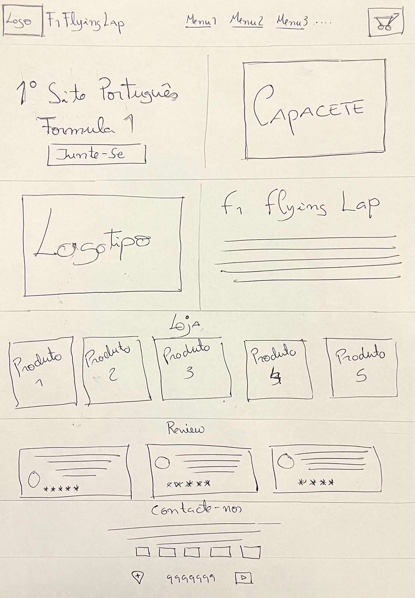
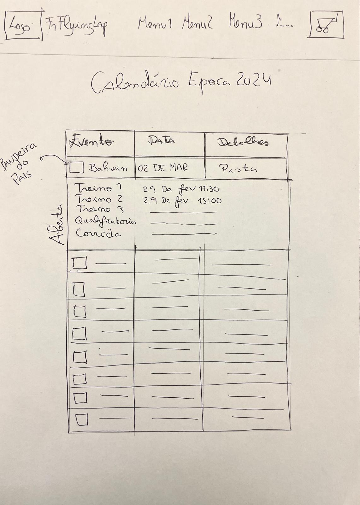
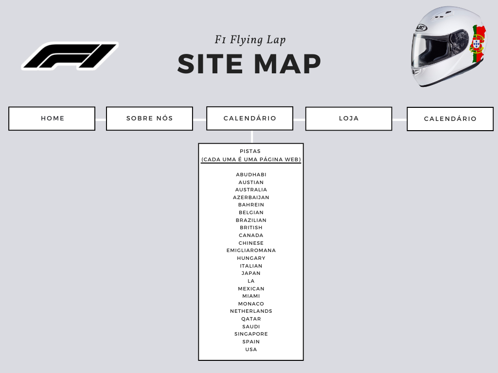

# Interface do Utilizador

_Nesta página, irei descrever como organizei as informações no site. Além disso, demonstrarei através de desenhos de planejamento como foi pensada a sua estrutura e a organização das páginas._ 

## Interface e Funções
_Add here your creative process results using sketchs or wireframes (or both)_

### Desenhos

_Desenhos de Planeamento do Site_

| | |
:---: | :---:
    |   
Always add a description to help the user understand the figure |  Always add a description to help the user understand the figure 

### Wireframes

_Your wireframes with a description_  

| |
:---:
 |
Always add a description to help the user understand the figure |

### Mapa Do Site 

Mapa do Site -- Flying Lap F1

  
Mapa de Ligaçoes Website Flying Lap F1

---
[< Previous](Grupo.md) | [^ Main](../../../) | [Next >](c3.md)
:--- | :---: | ---: 
